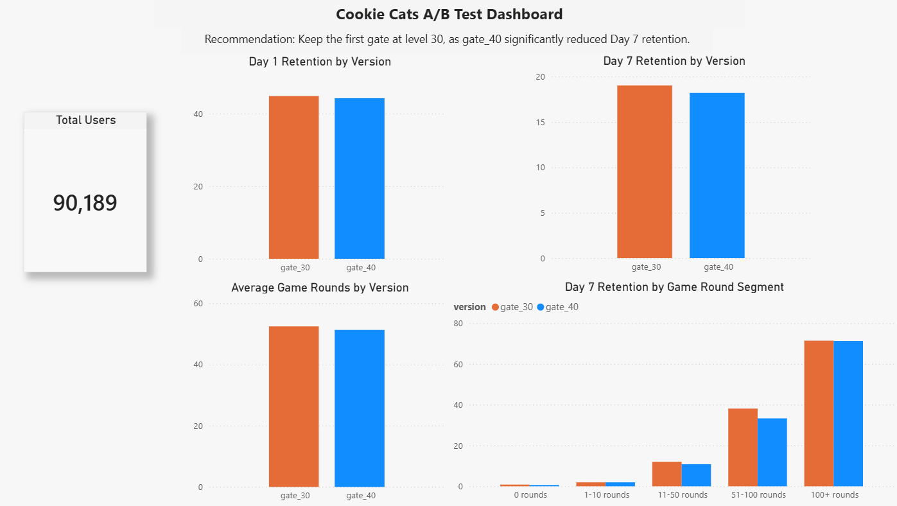

# Mobile Game Retention A/B Testing Analysis

## Project Overview

This project analyzes an A/B test from the mobile game **Cookie Cats**, where the first in-game gate was moved from **level 30** to **level 40**. The goal is to evaluate whether delaying the first gate improves user retention and engagement.

The analysis focuses on three key metrics:

* Day 1 retention (`retention_1`)
* Day 7 retention (`retention_7`)
* Total game rounds played (`sum_gamerounds`)

The final recommendation is based on exploratory data analysis, statistical testing, SQL-based metric validation, and business interpretation.

---

## Business Question

Should the game keep the first gate at **level 30**, or move it to **level 40** to improve user retention and engagement?

The product hypothesis is that moving the gate later may reduce early friction and encourage users to play longer. However, the experiment results show that moving the gate to level 40 does not improve retention.

---

## Dataset

Dataset: **Mobile Games A/B Testing - Cookie Cats**

The dataset contains 90,189 users and 5 fields:

| Column           | Description                              |
| ---------------- | ---------------------------------------- |
| `userid`         | Unique user identifier                   |
| `version`        | Experiment group: `gate_30` or `gate_40` |
| `sum_gamerounds` | Total number of game rounds played       |
| `retention_1`    | Whether the user returned after 1 day    |
| `retention_7`    | Whether the user returned after 7 days   |

---

## Tools Used

* Python
* Pandas
* NumPy
* SciPy
* Statsmodels
* SQL / SQLite
* Matplotlib
* Power BI

---

## Methodology

The project followed these steps:

1. Loaded and inspected the Cookie Cats A/B testing dataset.
2. Checked data quality, including missing values, duplicate rows, user uniqueness, and data types.
3. Evaluated experiment group balance between `gate_30` and `gate_40`.
4. Compared core business metrics across experiment groups.
5. Conducted statistical tests:

   * Two-proportion z-test for Day 1 and Day 7 retention
   * Bootstrap confidence intervals for retention differences
   * Mann-Whitney U test for total game rounds
6. Used SQL to reproduce overall, version-level, and segment-level metrics.
7. Exported dashboard-ready CSV files for visualization.
8. Developed a business recommendation based on statistical and product impact.

---

## Data Quality Check

The dataset was clean and ready for analysis.

| Check          | Result |
| -------------- | ------ |
| Total users    | 90,189 |
| Missing values | 0      |
| Duplicate rows | 0      |
| Unique users   | 90,189 |

The experiment groups were also well balanced:

| Version |  Users | Percentage |
| ------- | -----: | ---------: |
| gate_30 | 44,700 |     49.56% |
| gate_40 | 45,489 |     50.44% |

This suggests that the experiment assignment was reasonably balanced.

---

## Core Metric Comparison

| Metric              | gate_30 | gate_40 | Difference: gate_40 - gate_30 |
| ------------------- | ------: | ------: | ----------------------------: |
| Average game rounds |   52.46 |   51.30 |                         -1.16 |
| Median game rounds  |      17 |      16 |                            -1 |
| Day 1 retention     |  44.82% |  44.23% |       -0.59 percentage points |
| Day 7 retention     |  19.02% |  18.20% |       -0.82 percentage points |

Initial metric comparison shows that `gate_40` underperformed `gate_30` across all three core metrics. However, statistical testing is needed to determine whether these differences are significant.

---

## Statistical Testing Results

### Two-Proportion Z-Test

| Metric          | gate_30 | gate_40 | Difference | p-value | Significant at 0.05 |
| --------------- | ------: | ------: | ---------: | ------: | ------------------- |
| Day 1 retention |  44.82% |  44.23% |   -0.59 pp |  0.0744 | No                  |
| Day 7 retention |  19.02% |  18.20% |   -0.82 pp | 0.00155 | Yes                 |

The Day 1 retention difference was not statistically significant. However, the Day 7 retention difference was statistically significant, showing that users in the `gate_40` group were less likely to return after 7 days.

---

### Bootstrap Confidence Intervals

| Metric          | Observed Difference | 95% Confidence Interval |
| --------------- | ------------------: | ----------------------: |
| Day 1 retention |            -0.59 pp |           [-1.25, 0.06] |
| Day 7 retention |            -0.82 pp |          [-1.33, -0.31] |

The Day 1 retention confidence interval includes 0, which supports the conclusion that the Day 1 difference is not statistically significant.

The Day 7 retention confidence interval does not include 0 and is entirely negative. This provides additional evidence that moving the gate to level 40 significantly reduced Day 7 retention.

---

### Mann-Whitney U Test for Game Rounds

| Metric             | gate_30 | gate_40 | p-value | Significant at 0.05 |
| ------------------ | ------: | ------: | ------: | ------------------- |
| Median game rounds |      17 |      16 | 0.05021 | No                  |

The difference in game rounds was marginal but not statistically significant at the 0.05 level. Although `gate_30` had slightly higher average and median game rounds, the strongest statistical evidence came from Day 7 retention.

---

## SQL Analysis

SQL was used to validate the core metrics and create dashboard-ready outputs.

The SQL analysis included:

* Overall user count and retention metrics
* Version-level comparison between `gate_30` and `gate_40`
* Experiment group balance check
* Segment-level retention by game round activity group

Segment analysis showed that `gate_40` did not outperform `gate_30` on Day 7 retention across key user activity groups. In particular, the `51-100 rounds` segment showed a notable Day 7 retention gap:

| Segment       | gate_30 Day 7 Retention | gate_40 Day 7 Retention |
| ------------- | ----------------------: | ----------------------: |
| 51-100 rounds |                  38.09% |                  33.31% |
| 100+ rounds   |                  71.39% |                  71.24% |

This suggests that delaying the gate did not create stronger long-term engagement, even among more active users.

---

## Dashboard

A Power BI dashboard was created to communicate the main A/B testing results, including:

* User count by experiment group
* Day 1 retention by version
* Day 7 retention by version
* Average game rounds by version
* Segment-level Day 7 retention
* Product recommendation summary

The Power BI dashboard file is available in the `dashboard/` folder.




---

## Business Recommendation

Based on the experiment results, the recommendation is to **keep the first gate at level 30** instead of moving it to level 40.

Although moving the gate to level 40 may appear less restrictive, the data does not support the hypothesis that it improves user retention or engagement. Day 1 retention was slightly lower but not statistically significant, while Day 7 retention was significantly lower for `gate_40`.

Because Day 7 retention is a stronger indicator of long-term engagement than Day 1 retention, the product decision should prioritize maintaining the existing gate placement at level 30.

---

## Key Takeaways

* The A/B test groups were balanced, with approximately 50% of users in each group.
* `gate_40` did not improve Day 1 retention, Day 7 retention, or average game rounds.
* Day 7 retention was significantly lower for `gate_40`.
* Bootstrap confidence intervals confirmed that the Day 7 retention drop was statistically meaningful.
* Game round differences were marginal but not statistically significant.
* The recommended product decision is to keep the first gate at level 30.

---

## Project Structure

```text
mobile-game-retention-ab-test/
│
├── data/
│   ├── raw/
│   │   └── cookie_cats.csv
│   ├── processed/
│   │   ├── cookie_cats_cleaned.csv
│   │   └── cookie_cats.db
│   └── dashboard/
│       ├── version_metrics.csv
│       ├── metric_differences.csv
│       ├── ztest_results.csv
│       ├── bootstrap_results.csv
│       ├── mannwhitney_results.csv
│       ├── sql_overall_metrics.csv
│       ├── sql_version_metrics.csv
│       ├── sql_group_balance.csv
│       └── sql_segment_metrics.csv
│
├── notebooks/
│   └── 01_eda_data_cleaning.ipynb
│
├── visuals/
│   └── powerbi_dashboard.png
│
├── dashboard/
│   └── cookie_cats_ab_test_dashboard.pbix
│
├── requirements.txt
└── README.md
```

---

## How to Run

1. Clone the repository.

```bash
git clone <repo-url>
cd mobile-game-retention-ab-test
```

2. Install dependencies.

```bash
pip install pandas numpy scipy statsmodels matplotlib jupyter
```

3. Open the notebook.

```bash
jupyter notebook notebooks/01_eda_data_cleaning.ipynb
```

4. Run the notebook from top to bottom.

5. The processed data and dashboard-ready CSV files will be exported into:

```text
data/processed/
data/dashboard/
```

---

## Final Conclusion

Moving the first gate from level 30 to level 40 did not improve retention or engagement. The most important finding is that `gate_40` significantly reduced Day 7 retention compared with `gate_30`.

Therefore, the recommended product decision is to keep the first gate at level 30.
